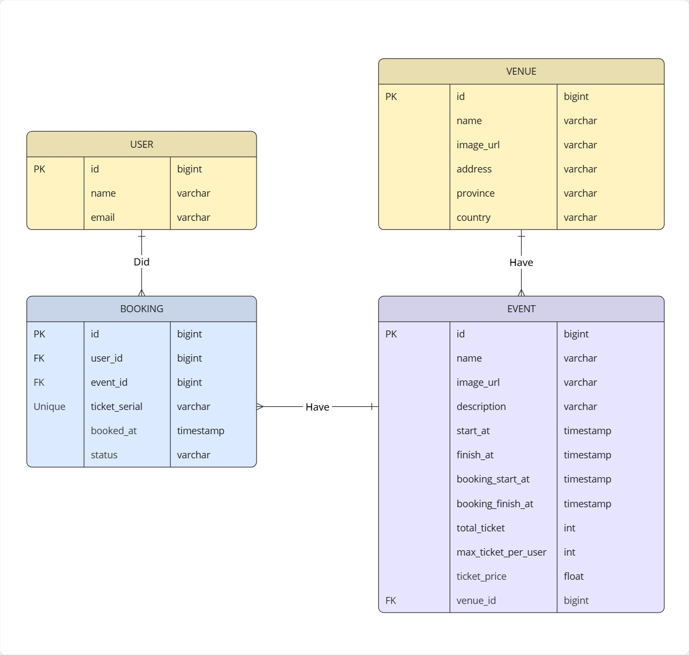

# Ticket Booking Project
## 1. How to run
### A. Build using Maven
First ensure you have MySQL installed in your system. Then create table and sample data by execute queries in `database.sql` .

After that we need to build the uber jar file using following commands:
```
mvnw clean package -DskipTests
mv /target/*.jar app.jar
```
Then pass the necessary database secret via environment variable before running the jar file. Example:
```
MYSQL_DATABASE=db \
MYSQL_PASSWORD=pass \
MYSQL_USER=user \
MYSQL_HOST=localhost:3306 \
java -jar app.jar
```
Or you can set the environment variable value in your shell. 

### C. Build using Docker
Before run we need to prepare a `.env` file in root projec folder that contains db secret. Example:
```
MYSQL_DATABASE=db
MYSQL_PASSWORD=pass
MYSQL_ROOT_PASSWORD=rootpass
MYSQL_USER=user
MYSQL_HOST=localhost:3306
```

Then run docker compose to activate the mysql and the API server:
```
docker compose up --build
```
After that, execute queries in `database.sql` file to create table and sample data.

## 2. Technical design
Based on requirements, we need to implement these use cases:
1. As a user i need to search available concerts. 
2. As a user i can book a ticket according to selected concert within specific hour, with limited number of tickets.

The goals of this repository is to focus on ticket booking mechanism, so we need limit the scope of the features. We 
will omit:
1. Authentication
2. Caching
3. Non important data such as performer, geolocation, tagging, etc.

This code implement basic data retrieval for concert and booking data. The details will be explained in next chapters.

We will add these constraints to improve usability during booking and searching:
1. Generalize concert data into `event`, separate location into `venue` data.
2. Each user may books more than 1 ticket, the data will called `booking`.
3. Each `event` has maximum booking limit for each user, to prevent abusement.
4. Each `event` has booking time duration, separated from actual event duration.

For the booking mechanism we will using this algorithm:
1. Check if user and event (concert) exist. If exists then continue.
2. Check if event ticket still available, booked ticket must be less than ticket limit. If available, continue.
3. Check if: `total user previous ticket + total new ticket request <= event ticket limit` . If true, continue.
4. Check if: `total user previous ticket + total new ticket request <= per user limit` . If true, continue.
5. Create `booking data` and store it to database.

## 3. Entity diagram
Here is the overview of database entity diagram:



Basically the idea are:
1. Concert is implemented as `event` and each event performed on a location called `venue`.
2. Each user may book 1 or more tickets for each event, each successfully booked ticket has its own data in database.
3. Each booked ticket data stored in `booking` table.
4. An `event` contains the detail of the event, ticket price & limit, when it is conducted, and when it is can be booked.
5. This repository is focused on booking implementation, so we only store basic user account in `user` table
6. `venue` data mainly used for locating and limit events location. Only basic location details implemented.

## 4. API
### A. Book tickets
Let user book 1 or more ticket from a event.

Request
```
POST /api/v1/booking/ticket
Content-Type: application/json

{
  "userEmail": "pratama@gmail.com",
  "requestedTicket": 1,
  "eventId": 1
}
```

Response
```
{
    "id": 25,
    "userId": 3,
    "eventId": 1,
    "ticketSerial": "BOOK-1771593769-1",
    "bookedAt": "2026-02-20T20:22:49.8413358",
    "status": "BOOKED"
}
```
Return error if:
1. User exceeding event limit
2. There are no more tickets

### B. Get events
Retrieve events based on pagination, name/description phrase, or event finish date. All query is optional, default is 10
item per page and without finish date filter.

Request
```
GET /api/v1/event?page=0&pageSize=1&name=april&description=mop
```
Response
```
[
  {
    "id": 2,
    "name": "april mop concert",
    "imageUrl": "https://blogger.googleusercontent.com/img/b/R29vZ2xl/AVvXsEhcQdysvdzlKg2AN8ygE6p0zg37eW9lDE9SEh8XkG0DxxhCXrVk1aGTEbkDD7Tl_zRzQSvj-7X_I6C_0uhXFqpKYzs29EWaUz5lS1OG7l9RYt0caokqlI1v8q5FpRSH_UG9pY7sJMBs8x4/s1600/event.png",
    "description": "april mop concert, only in 2026",
    "startAt": "2026-04-02T00:00:00",
    "finishAt": "2026-04-02T03:00:00",
    "bookingStartAt": "2026-04-01T00:00:00",
    "bookingFinishAt": "2026-04-01T10:00:00",
    "totalTicket": 50,
    "maxTicketPerUser": 3,
    "ticketPrice": 500000,
    "venueId": 2
  }
]
```

### C. Get venues
Retrieve venues of event based on given location (city/country) and pagination. All query is optional, the default is 
10 item per page and without location filter.

Request
```
GET /api/v1/venue?page=0&pageSize=10&city=jakarta&country=indonesia
```

Response
```
[
  {
    "id": 1,
    "name": "gbk",
    "imageUrl": "https://media.istockphoto.com/id/1434062157/id/foto/lapangan-stadion-sepak-bola-rendering-3d-latar-belakang-sepak-bola.jpg?s=612x612&w=0&k=20&c=i3CMAdmpxy5mMppJ_hkaLnhHoo9HpCS_YeVfKHmuZ6g=",
    "address": "stadium gbk",
    "city": "jakarta",
    "country": "indonesia"
  }
]
```

### D. Get bookable events
Return all events that can be booked right now.

Request
```
GET /api/v1/event/bookable
```

Response
```
[
  {
    "id": 4,
    "name": "february super party",
    "imageUrl": "https://voca-land.sgp1.cdn.digitaloceanspaces.com/-1/1769868458106/1719a5ec.jpg",
    "description": "super party on the wonderful february. let's celebrate!",
    "startAt": "2026-02-25T00:00:00",
    "finishAt": "2026-02-25T04:00:00",
    "bookingStartAt": "2026-02-19T00:00:00",
    "bookingFinishAt": "2026-02-22T00:00:00",
    "totalTicket": 20,
    "maxTicketPerUser": 1,
    "ticketPrice": 120000,
    "venueId": 1,
    "venueName": "gbk",
    "venueCity": "jakarta",
    "venueCountry": "indonesia"
  }
]
```

### E. Get upcoming events
Return upcoming events based on given time limit (`until`). The limit is optional, and the default is 30 days from today.

Request
```
GET http://localhost:8080/api/v1/event/upcoming?until=2026-03-03T00:00:00
```

Response
```
[
  {
    "id": 4,
    "name": "february super party",
    "imageUrl": "https://voca-land.sgp1.cdn.digitaloceanspaces.com/-1/1769868458106/1719a5ec.jpg",
    "description": "super party on the wonderful february. let's celebrate!",
    "startAt": "2026-02-25T00:00:00",
    "finishAt": "2026-02-25T04:00:00",
    "bookingStartAt": "2026-02-19T00:00:00",
    "bookingFinishAt": "2026-02-22T00:00:00",
    "totalTicket": 20,
    "maxTicketPerUser": 1,
    "ticketPrice": 120000,
    "venueId": 1,
    "venueName": "gbk",
    "venueCity": "jakarta",
    "venueCountry": "indonesia"
  }
]
```

### F. Get events from a venue
Return all events that happened in a venue. The path parameter is the id of venue and it is required.

Request
```
GET /api/v1/event/venue/2
```
Response
```
[
  {
    "id": 2,
    "name": "april mop concert",
    "imageUrl": "https://blogger.googleusercontent.com/img/b/R29vZ2xl/AVvXsEhcQdysvdzlKg2AN8ygE6p0zg37eW9lDE9SEh8XkG0DxxhCXrVk1aGTEbkDD7Tl_zRzQSvj-7X_I6C_0uhXFqpKYzs29EWaUz5lS1OG7l9RYt0caokqlI1v8q5FpRSH_UG9pY7sJMBs8x4/s1600/event.png",
    "description": "april mop concert, only in 2026",
    "startAt": "2026-04-02T00:00:00",
    "finishAt": "2026-04-02T03:00:00",
    "bookingStartAt": "2026-04-01T00:00:00",
    "bookingFinishAt": "2026-04-01T10:00:00",
    "totalTicket": 50,
    "maxTicketPerUser": 3,
    "ticketPrice": 500000,
    "venueId": 2
  },
  {
    "id": 3,
    "name": "wonderful saturday concert",
    "imageUrl": "https://voca-land.sgp1.cdn.digitaloceanspaces.com/-1/1769868458106/1719a5ec.jpg",
    "description": "wonderful saturday of 2026",
    "startAt": "2026-04-03T00:00:00",
    "finishAt": "2026-04-03T03:00:00",
    "bookingStartAt": "2026-04-02T00:00:00",
    "bookingFinishAt": "2026-04-02T03:00:00",
    "totalTicket": 30,
    "maxTicketPerUser": 1,
    "ticketPrice": 100000,
    "venueId": 2
  }
]
```

## 5. Further ideas
1. We can improve concerts search performance by using dedicated search engine such as Elasticsearch and Manticore.
Current implementation using SQL LIKES with both prefix and suffix, which is slow for large data. By using dedicated
search engine we can implement complex searching such as: tagging search, ignore case sensitivity, search by venue, etc.
2. Implement more complex location for locating concerts. Add province, online maps coordinate, etc. Also we need to
standardize all city and country data, and store it into its own database table or save it into a static JSON file. 
3. Add caching mechanism for storing frequent search, store the cache in in-memory storage such as redis and memcache.
4. Implement payment transaction, connect `booking` data with invoice and others detail. The `status` column of `booking`
can be changed into `PAID` when user paid the transaction.
5. Add countdown for each booked ticket, maybe 30 minutes. This will encourage users to paid the ticket immediately.
when countdown is zero, the booking will be cancelled, and it will give chance to other users to create new booking.
To implement this we will create a basic worker in backend that will delete `booking` data, if the booking time exceeded
30 minutes.
6. For security purpose, we need to implement authentication to all API . Implement password system, and use JWT token
to interact between client (mobile, web, etc) and backend API. Also we need to implement rate limiting in API gateway
(nginx, kong, etc) to prevent brute force requests from script/bot during ticket booking war.